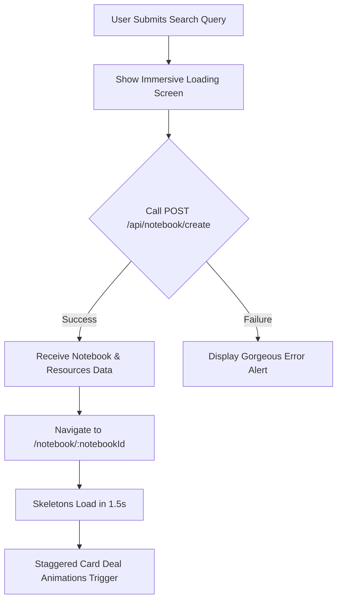

# Plan: Real Backend API Integration & Staggered Deal Animations

We will connect the frontend query input directly to the `/api/notebook/create` backend endpoint and build a rich, premium user experience including a dedicated full-screen loading interface, smooth routing transitions, and springy staggered card-dealing animations.

## Key Objectives

1. **Connect Search Submission**: Wire `handleCreateNotebook` in `HomePage.tsx` to the `addNotebook` action in `useKanbanStore` which executes `POST /api/notebook/create`.
2. **Beautiful Immersive Loading Screen**: When creation is initiated, show a gorgeous, full-screen loading modal that cycles through realistic AI orchestrator status updates with elegant pulsing loaders.
3. **Smooth Page Transitions**: Navigate programmatically to the newly created notebook at `/notebook/:id` immediately upon generation using a smooth exit/enter transition.
4. **Spring-Loaded Card Dealing**: Refactor Kanban card rendering in `ResourceCard.tsx` to slide down, rotate slightly, and snap into place one-by-one with springy curves and dynamic stagger delays.
5. **Robust Error Handling**: Gracefully catch generation errors (e.g. invalid topics, empty results, model quota limits) and display them in a visually matching inline banner/toast.

---

## 🛠️ Detailed Steps

### 1. Central Styling Updates (`frontend/src/styles/global.css`)
- Define the `@keyframes cardDeal` spring curve animation.
- Add `.animate-card-deal` with custom spring transition.
- Keep layout transitions fluid and elegant.

### 2. Spring-Loaded Card Deal (`frontend/src/components/ResourceCard.tsx`)
- Update className mapping from `animate-drop-in` to `animate-card-deal`.
- Apply dynamic inline `animationDelay` based on the item `index` (e.g., `index * 150 + "ms"`).
- Keep drag handles and touch sensors fully responsive.

### 3. Beautiful Immersive Loading Screen (`frontend/src/components/LoadingScreen.tsx`)
- Create a high-fidelity loading viewport.
- Render dynamic text descriptions that shift elegantly.
- Include abstract spinning rings/rotators for a premium AI vibe.

### 4. Wire Creation and Programmatic Navigation (`frontend/src/pages/HomePage.tsx`)
- Integrate `useNavigate` from `react-router-dom` to automatically forward users to the new notebook's details page.
- Render the `LoadingScreen` when submission is active.
- Add an elegant floating toast banner for backend errors (like `INVALID_TOPIC` or `NO_SEARCH_RESULTS`).

### 5. Transition Polish (`frontend/src/pages/NotebookPage.tsx`)
- Add subtle fade-in / slide-up animations to the main header and info blocks using standard Tailwind styling and `framer-motion` for a premium entrance effect.
