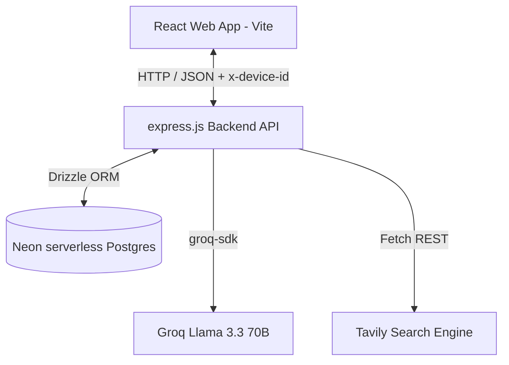
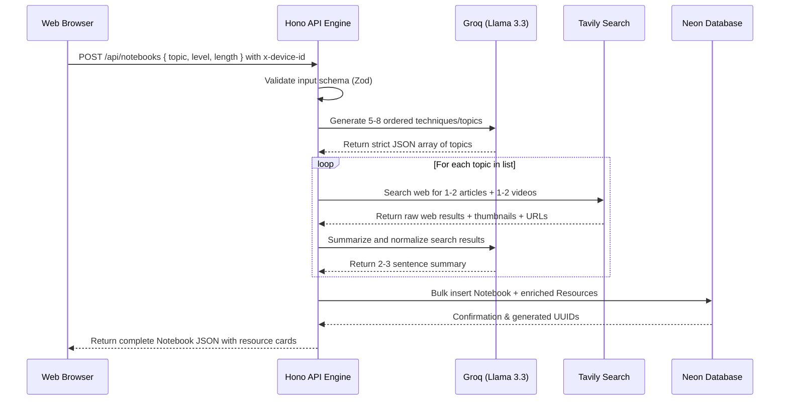

# Architecture

**Analysis Date:** 2026-05-26

> [!NOTE]
> This is a **Greenfield Project** under active bootstrapping. The architectural layout described below is modeled from the system specifications in `dev_docs/prd.md` to guide physical component building.

## Pattern Overview

**Overall:** Monorepo with a Layered React Web Frontend and a Serverless-Ready express.js API Backend.

**Key Characteristics:**

- **Decoupled Monorepo:** Distinct frontend and backend application roots inside `apps/` to isolate concern boundaries.
- **Stateless Request Model:** The backend API has no persistent session state; all DB scopes are injected per-request using client-provided device identifiers.
- **Synchronous Enrichment Cycle:** Content generation (AI mapping and internet search) occurs in a single synchronous REST lifecycle upon notebook creation, simplifying job queue architectures.
- **Optimistic UI Updates:** Drag-and-drop operations perform local frontend transitions immediately while resolving the API sync asynchronously, giving the appearance of instant actions.

---

## Conceptual Layers

### 1. Presentation & Client-State Layer (`apps/web/`)

- **Purpose:** Serve the interactive user workspace, gather configuration data, render Kanban columns, and track progress.
- **Components (`apps/web/src/components/`):** React components (such as board views, resource cards, and creation dialogs) styled with Tailwind CSS and Radix/shadcn primitives.
- **Global UI State (`apps/web/src/stores/`):** Zustand stores managing client-only concerns (e.g., active drag-and-drop statuses).
- **Asynchronous Sync (`apps/web/src/hooks/`):** Custom TanStack React Query hooks acting as the communication bridge, handling cached requests and triggers.

### 2. API Routing & Middleware Layer (`apps/api/src/routes/` & `/middleware/`)

- **Purpose:** Expose access interfaces, validate schema contracts, inject security, and translate exceptions.
- **Middleware:** `device-id` extractor checking for custom headers and attaching validation tags to the request context.
- **Validation:** Zod schemas performing rigid checks on incoming payloads (e.g., matching topic lengths or card status formats).

### 3. Business Service Layer (`apps/api/src/services/`)

- **Purpose:** Run core platform behaviors (AI course mapping, search enrichment, metadata filtering).
- **Planner Service:** Invokes Groq to generate ordered topic structures.
- **Enricher Service:** Spawns Tavily queries, processes search yields, and feeds raw data back to Groq for summaries.

### 4. Database Access Layer (`apps/api/src/db/`)

- **Purpose:** Define application model constructs and run storage queries.
- **Drizzle Schema:** Single source of truth for the physical structures of `notebooks` and `resources` models.

---

## Data Flow

### A. Notebook Creation Workflow

### B. Kanban Interaction Flow (Drag-and-Drop)

1. The user drags a card from the `Todo` column to `Doing`.
2. `@dnd-kit/core` triggers the local component transition.
3. Zustand / React Query applies an **optimistic update**, moving the card immediately in the UI.
4. An async call fires `PATCH /api/resources/:id/status` with the new status.
5. Hono.js runs: `UPDATE resources SET status = ?, updated_at = NOW() WHERE id = ? AND notebook_id IN (SELECT id FROM notebooks WHERE device_id = ?)`.
6. On API success, the local UI state is finalized. On error, the card is rolled back to `Todo` and a toast alert is rendered.

---

## Key Abstractions

**Anonymous Request Scope:**

- Scopes data queries via backend middleware that extracts `x-device-id` and binds it to database query builders, eliminating raw cross-tenant leaks.

**Optimistic Queries:**

- Custom React Query mutation structures encapsulating local cache rollbacks to keep UI interactions responsive.

---

## Entry Points

**Frontend Web Application:**

- `apps/web/src/main.tsx` - Root rendering file initializing the DOM, React Query providers, and stylesheet bindings.

**Backend HTTP API:**

- `apps/api/src/index.ts` - Node.js server bootstrapper using Hono's HTTP routing listener to load global middlewares and route prefixes.

---

## Error Handling

**Strategy:** Global middleware exception catcher intercepting bubbles and formatting clean API responses.

- **Fail Fast:** Zod schemas instantly return `400 Bad Request` with structured validations when request payloads mismatch expectations.
- **Resource Protection:** Attempts to query or mutate records that do not belong to the requesting `device_id` result in a `404 Not Found` or `403 Forbidden` response.
- **Transient API Failures:** Calls to external integrations (Groq, Tavily) use robust standard try/catch blocks, returning friendly error payloads if either platform goes down.

---

_Architecture analysis: 2026-05-26_
_Update when major patterns change_
